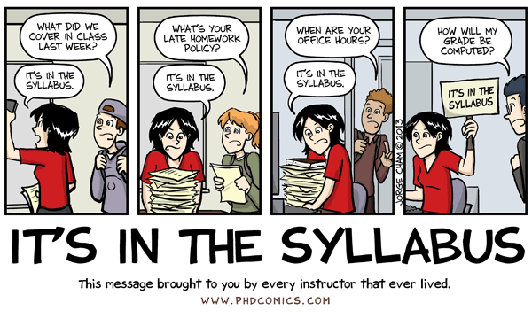

% Test Presentation
% Yada yada
% Week 1

# Welcome to EDUC W200

Teaching with Technology | Computer Use in Education

--------------------------

# Class Warm-Up

*Making the transition from where you were to where you are now*

* What is your **name**
* What is **one thing you learned** over the break?

--------------------------

# About Me

Dr. Jeremy Price (jfprice@iupui.edu)

---------------------------

# Course Business
## The Syllabus

---------------------------

# Course Business
## Canvas

----------------------------

## What Does Teaching With Technology Look Like?

*People* / *Activities* / *Relationships* / *Technologies* / *Norms* / *Outcomes*

--------------------------

# Classroom of the Future

<iframe width="560" height="315" src="https://www.youtube.com/embed/kUWwfcJ1-jQ" frameborder="0" allowfullscreen></iframe>

---------------------------

# This Will Revolutionize Education

<iframe width="560" height="315" src="https://www.youtube.com/embed/GEmuEWjHr5c" frameborder="0" allowfullscreen></iframe>