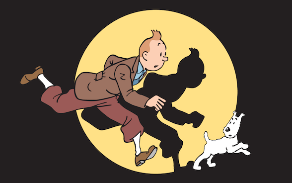
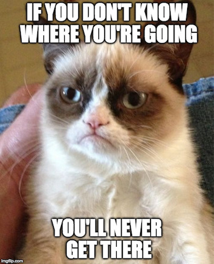
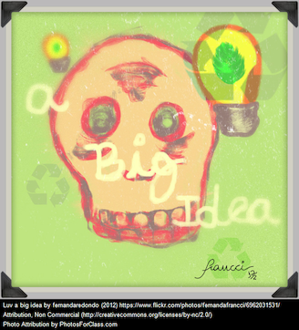
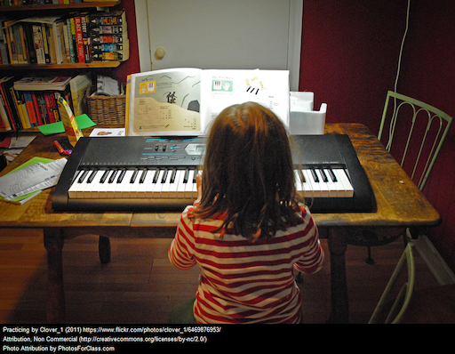
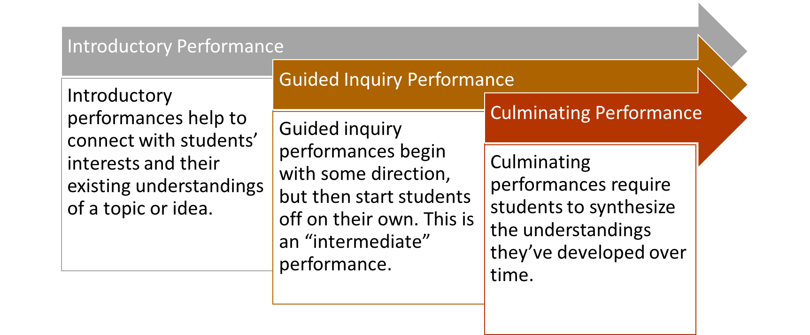

% Class Presentation
% Week 13

[comment]: # Make with pandoc --section-divs -t revealjs -s --template template.revealjs --self-contained -o w200-presentation-week13.html w200-presentation-week13.md

# Starting Your WebQuest Design Journey {data-background="media/week13/two_roads.jpg"}

# Warm-Up

What Would You Put On Your Teacher's Desk?

# Packing Your Backpack {data-background="media/week13/backpack-map.png"}

# Where We're Going

  * Essential Questions
  * Goals and Objectives
  * Performances
  * Use What You Know
  * Sneak Peak to Next Week (Week of April 17-21)

# The Importance of Essential Questions

[Essential Questions](https://www.teachingchannel.org/videos/structure-learning-essential-questions)

# Why Goals and Objectives? {data-background="media/week13/youarehere.jpg"}

# Goals and Objectives

# Goals...

...Are The Big Questions/Ideas and Deep Thoughts to Explore

# Objectives...

...Are the Skills and Practices to Develop

# Performances that Build Understanding

# Use What You Know

**padlet.com/jfprice/cps17{day}{table}**

padlet.com/jfprice/cps17ma

padlet.com/jfprice/cps17wa

bit.ly/w200wq17

# Sneak Peak: Critical Friends

[Critical Friends](https://www.teachingchannel.org/videos/reflection-on-student-work-ntn)
