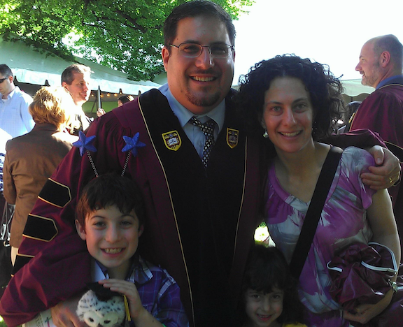
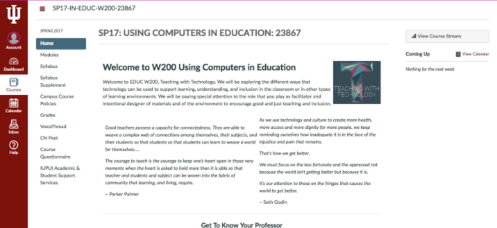
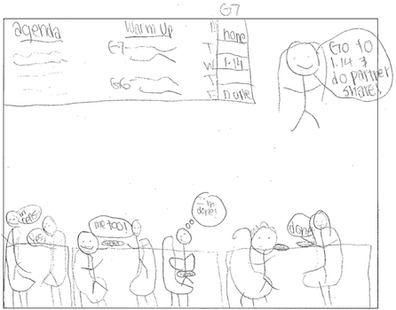
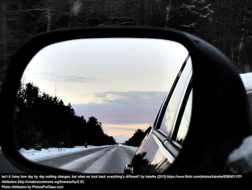
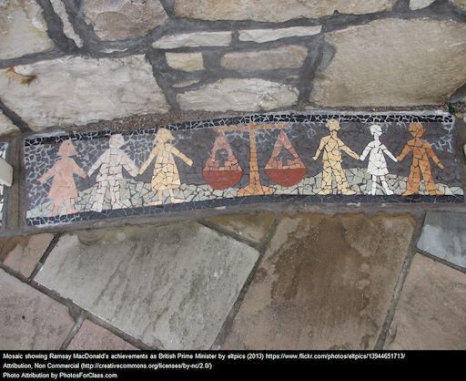

% Class Presentation
% Weeks 1-2

[comment]: # Make with pandoc --section-divs -t revealjs -s --template template.revealjs --self-contained --slide-level 2 -o presentation-week1_2.html presentation-week1_2.md

# Welcome to EDUC W200

Teaching with Technology | Computer Use in Education

## Class Warm-Up

*Making the transition from where you were to where you are now*

* What is your **name**
* What is **one thing you learned** over the break?

## About Me

Dr. Jeremy Price (jfprice@iupui.edu)

# Course Business

## The Syllabus

## Canvas

# What Does Teaching With Technology Look Like?

## Imagine Your Future

*People* / *Activities* / *Relationships* / *Technologies* / *Norms* / *Outcomes*

# What Do These Scenarios Mean To You?

## Classroom of the Future

<iframe width="560" height="315" src="https://www.youtube.com/embed/kUWwfcJ1-jQ" frameborder="0" allowfullscreen></iframe>

## This Will Revolutionize Education

<iframe width="560" height="315" src="https://www.youtube.com/embed/GEmuEWjHr5c" frameborder="0" allowfullscreen></iframe>

# Enduring Understandings: Goals for the Course

## Overarching
Technology can serve as a resource to connect with other teachers to grow, learn, and participate in a community of educators engaged in good and just teaching.

## Self
Past experiences with education and technology influence who teachers are in the present as a student and in the future as an educator engaged in good and just teaching.

## Truth
Technology can be used to embrace, provide access to, and find truth in the complexities of the information-driven modern era.

## Community
Technology can serve as a medium for teachers to work in solidarity with students, schools, and communities.

## Justice
Thoughtful, intentional, and critical evaluation of and planning with technology can help teachers participate in good and just teaching.

# What Is Meant By 'Good' and 'Just'?

## What Is Meant By 'Good' and 'Just'?

  * How do you define 'Good' and 'Just'?
  * How are the terms similar?
  * How are the terms different?
  * What do 'Good' and 'Just' look like in the classroom?
  * What roles could technology play?

# What the 'Experts' Say about Good and Just Teaching

## Focusing on the Good

  * Start your focus on 'students in the margins'
  * The 'what' and 'how' of teaching is held to rigorous standards
  * Teachers have high expectations of all students
  * Teachers engage students in opportunities for critical questioning

(Cochran-Smith et al., 2009; Grant, 2012; Rose & Meyer, 2000)

## Focusing on the Just

  * Recognition that there are disparities in educational opportunities, resources and achievement between marginalized students and their wealthier white counterparts
  * Engage in a critique of the universalist views of knowledge which do not adequately recognize the experiences and knowledge of marginalized groups
  * Provide curriculum and content that is both challenging and culturally sustaining
  * Practice democracy and engage in social activism in the classroom

(Cochran Smith et al., 2009; Grant, 2012)

## Focusing on the People at the Intersection

  * Look deeply into you, who you are, what you value, what role you see yourself playing in the larger society and how your own traditions and experiences have influenced you
  * Be a 'friend of their minds' ('Make yourself a teacher, find yourself a friend,' *Pirke Avot* 1:6)
  * Find and surround yourself with others who will learn and grow with you and support you along your journey

(Grant, 2012)

# Which Are Your Top Goals?

## Order Your Goals

<iframe src="https://embed.polleverywhere.com/ranking_polls/hbgkv1CRjPwJkRz?controls=none&short_poll=true" width="100%" height="100%" frameBorder="0"></iframe>