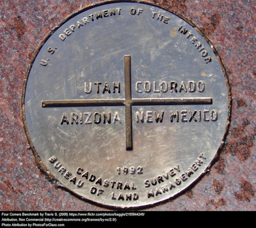
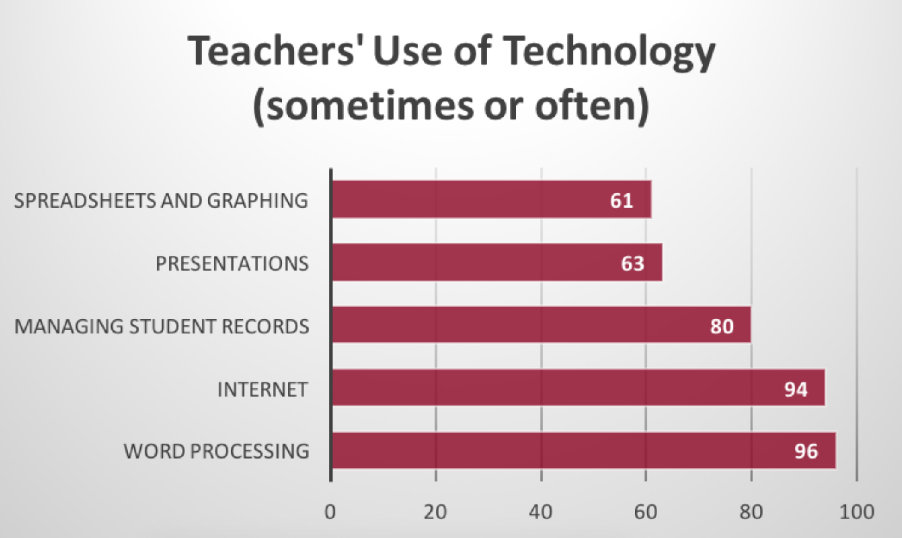
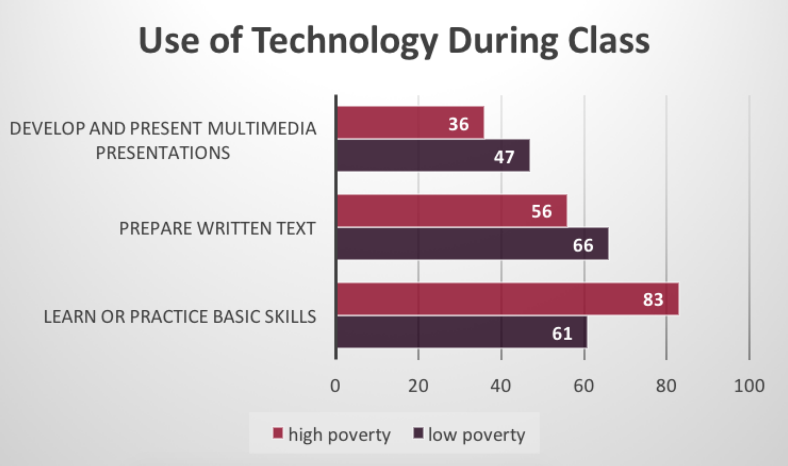
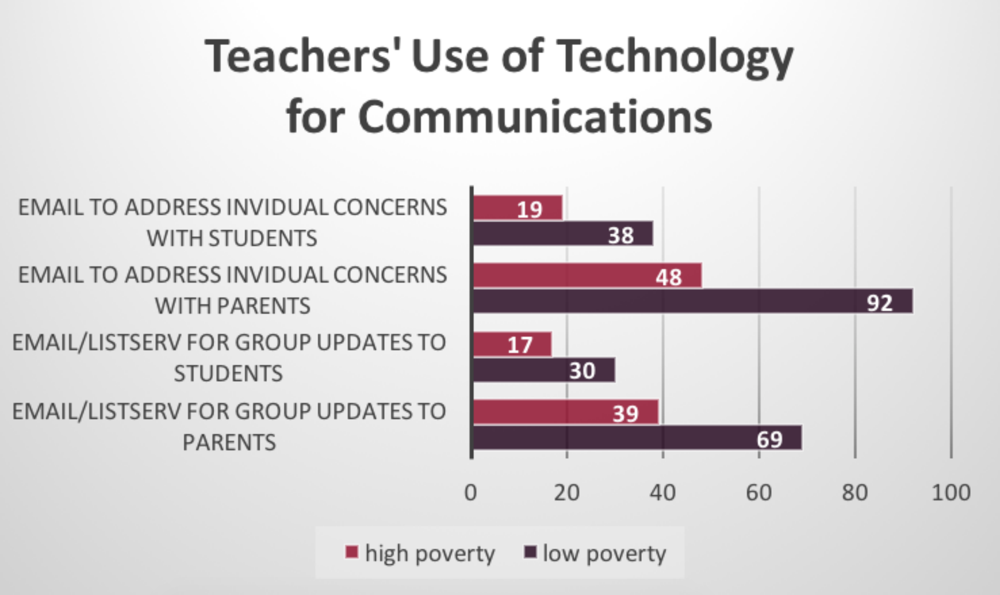

% Class Presentation
% Week 3

[comment]: # Make with pandoc --section-divs -t revealjs -s --template template.revealjs --self-contained -o w200-presentation-week3.html w200-presentation-week3.md

# Week 3

A Four Corners Day

# Guidelines

Start off your comments with "As a..." or "Based on my experiences..."

---

"The introduction of computers into schools... improve academic achievement and alter how teachers \[teach\]."

\- Larry Cuban

---

"Our goal in education should be to foster the ability to use the computer in everything you do, even if you don't have a specific piece of software for the job."

\- Seymour Papert

---

"Teaching in the Internet age means we must teach tomorrow's skills today."

\- Jennifer Fleming

---

"The future is already here \-
it's just not evenly distributed."

\- William Gibson

---

---

---

---

<iframe width="560" height="315" src="https://www.youtube.com/embed/7lZglztOy0c" frameborder="0" allowfullscreen></iframe>

---

"One thing that's been interesting... to watch is that people that say facts are facts — they're not really facts. Everybody has a way — it's kind of like looking at ratings or looking at a glass of half-full water. Everybody has a way of interpreting them to be the truth or not true. There's no such thing, unfortunately anymore, of facts."

\- Scottie Nell Hughes

---

"In the tech sector, we imagined that... \[we\] would bring people together for a healthier democracy. We hung onto this belief even as we saw that this wasn’t playing out. We built the structures for hate to flow along the same pathways as knowledge...."

\- dana boyd

# Your Blogging Assignment

  * Choose a prompt and write about why you took the position you did.
  * Identify one or more experiences that you had or a value that was taught to you by your family, friends or teachers that led you to take that position.
  * If you changed your position, please explain why. If you did not change your position, please explain why.
