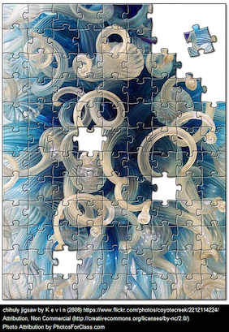

% Class Presentation
% Week 4

[comment]: # Make with pandoc --section-divs -t revealjs -s --template template.revealjs --self-contained -o w200-presentation-week4.html w200-presentation-week4.md

# Technology and Post-Truth {data-background="media/week4/truth.png"}

# Post-Truth Defined

"Relating to or denoting circumstances in which objective facts are less influential in shaping public opinion than appeals to emotion and personal belief." *\- OED*

# What Role Does Technology Play?

# Starting a Jigsaw Analysis

# Jigsaw Part 1A

Get into your groups and use your tool to analyze the first news story.

http://go.iu.edu/1tjt

As you are analyzing the story, think about the following questions:

  * How did your tool help you consider the news story?
  * What were some of the strengths of using this tool? Where did this tool fall short?
  * What did you learn about analyzing online materials?

# Jigsaw Part 1B

Move to new groups as assigned and discuss your findings.

# Jigsaw Part 1C

More information to consider...

http://go.iu.edu/1tju

# Jigsaw Part 2A

Use a tool, or parts of different tools, to analyze your new story.

  1. http://go.iu.edu/1tjC
  2. http://go.iu.edu/1tjD
  3. http://go.iu.edu/1tjG
  4. http://go.iu.edu/1tjI
  5. http://go.iu.edu/1tjK
  6. http://go.iu.edu/1tjL

# Jigsaw Part 2B

Return to your original groups, share about your news story, and how you analyzed it.

# How Can We Be Certain Of Anything These Days?

"Knowledge consists in the search for truth.... Since we can never know anything for sure, it is simply not worth searching for certainty; but it is well worth searching for truth...." *-Karl Popper*

# Why Is This Process Important?

Evil '...possesses neither depth nor any demonic dimension. It can overgrow and lay waste the whole world precisely because it spreads like a fungus on the surface. It is "thought-defying"... because thought tries to reach some depth, to go the roots.... Only the good has depth and can be radical.' *-Hannah Arendt*

---

When Primo Levi arrived at Auschwitz he reached, in his thirst, for an icicle outside his window but a guard snatched it away. “Warum?” Levi asked (why?). To which the guard responded, “Hier ist kein warum” (here there is no why).
