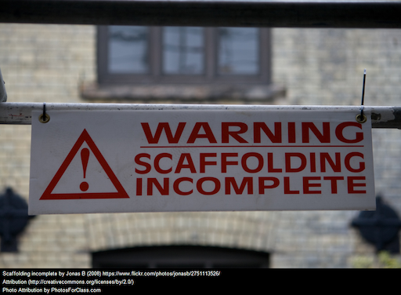
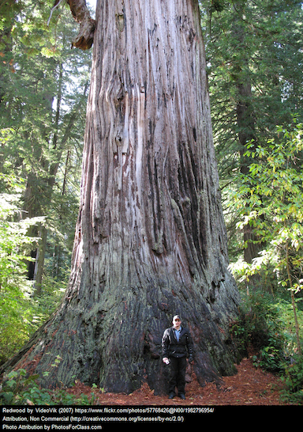
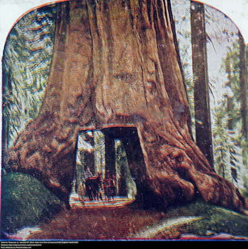

% Class Presentation
% Week 7

[comment]: # Make with pandoc --section-divs -t revealjs -s --template template.revealjs --self-contained -o w200-presentation-week7.html w200-presentation-week7.md

# Investigating Scaffolding

# Warm-Up

 

# Strategies Can Be Scaffolding {data-background="media/week7/catreading.png"}

# Strategies Can Be Scaffolding

  * Critical Reading
  * Contemplative Reading
  * Strategic Reading for Comprehension

---

## Critical Reading

  * Is it a credible source?
  * What is the point of view?
  * Does it align with other sources and with reality?
  * Who benefits?

## Contemplative Reading

  * Surface/Straight Reading
  * Your Emotional Reading
  * Deep Story Reading
  * Empathetic Reading

## Strategic Reading for Comprehension

  * Question
  * Visualize
  * Summarize
  * Predict

# Identifying the Features

What scaffolding and supports are available to the reader?

http://go.iu.edu/1tCd

# Embedding Your Own Strategies

http://bit.ly/w200-ed-in-class

* Question
* Visualize
* Summarize
* Predict

# What Is My Role? {data-background="media/week7/garden.png"}

**Teacher As Gardener**
