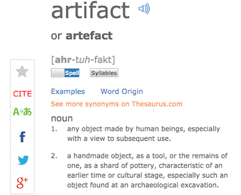

This reference sheet will lead you through the process of getting started with eMargin. eMargin (http://emargin.bcu.ac.uk) allows you to mark up, annotate, and hold conversations around a text, document, or webpage.

# Registering for an eMargin Account

* Follow the link that is provided to you in Canvas, which will put you in the correct section of the course.
* Fill out the form with a username, your email address (I recommend using your IUPUI address), password, etc. Make sure you check the box next to "I agree to be bound by the Terms of Use" and then click on the \[Sign Up\] button.

\ 

* After you click on the \[Sign Up\] button, you will be taken to your "Home," where you will see all of your assigned texts.

# Annotating A Document 

* On your "Home," find your assigned text and click on the name of the text.

\ 

* After you click on the name of the text, you will be taken to the text itself. There is a "Command Palette" on the right-hand side of the page, which you can ignore for now. You can also change the text size by clicking on the \[a\] button (to make the text size smaller) and the \[A\] button (to make the text size larger) at the top of the page.

\ 

## Adding a Highlight and Comment

* You will be provided with information on how you are to annotate the text. Typically, different tasks will have different highlight colors.

* Using your mouse, highlight a word, phrase, or sentence that you want to annotate. An annotation box will pop up.

\ 

* Click on the button that looks like a painter's palette and a drop down menu of colors will appear. Choose the color that represents the annotation task. In this example, I chose "Green" to represent the fact that I have a question about this phrase. You will see that the word "Question?" appears next to the painter's palette button to indicate that the question annotation has been selected.

\ 

* Now in the larger text box, you may write some comments. For this example, because I have a question about the phrase, I entered my question about the phrase. (Sorry, you can't use this same question when you read the text.)

\ 

* After entering your comment, click on the \[Save\] button. You can close the annotation box by clicking on the \[x\] button in the upper right corner of the box.

## Bonus: Researching Up A Term

Another feature of eMargin is that it allows you to look up words or phrases that you may be unfamiliar with.

* Highlight an unfamiliar word or phrase in the text.

\ 

* Click on the "Research" button, which looks like a magnifying glass. Then click on a service to research your term or phrase. In this example, I will click on "Dictionary.com."

\ 

* A new tab will open with information about your term or phrase, such as the Dictionary.com definition of the term "artifact." To return to the text in eMargin, simply close this new tab.

\ 

# Closing Up Shop

* Although not necessary, it is always a good idea to return to your Dashboard or Home page. So, when you are finished, click on the "Home" link at the top of the page directly underneath the eMargin logo.

**And that's it!**
