# Reference Sheet: VoiceThread

This reference sheet will lead you through the process of getting started with VoiceThread. VoiceThread allows conversations to be conducted around a set of images, videos or slides.

## Navigating to VoiceThread

-   Log in to Canvas, such as by navigating to <http://canvas.iu.edu/>, and then navigate to this course.

-   Find the VoiceThread Link in the course sidebar and click on it.

\ 

-   At this point, you will be taken to the "VoiceThread Setup" page within Canvas. For ease of use, it is recommended that you click on the "Open in a new tab" link.

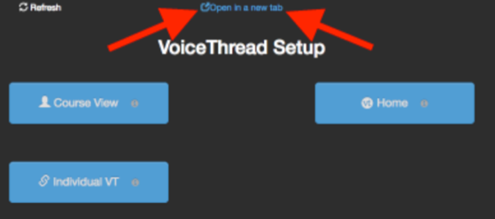
\ 

-   Now click on the button labeled "Individual VT," which will bring you to your individual VoiceThread Dashboard.

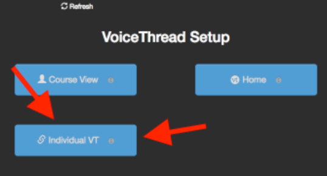
\ 

-   You should now see a list of recent activity, which will probably include an VoiceThreads you have created recently and possibly any VoiceThreads you have left comments on. In order to create your own VoiceThread, click on the "Create new VoiceThread" button in the top-left corner of the page.

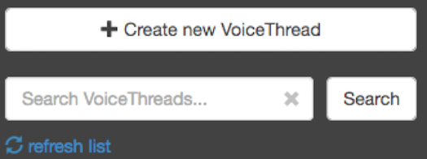
\ 

-   Once you click on the button, the page will change and you will be provided with the "Create new VoiceThread" screen. You can go ahead and start creating. To get started, you want to add some media. Click on the large "+ Add Media" button, which will provide you with a number of different options.

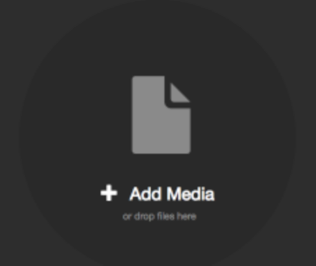
\ 

## Adding Your Own Files

- You can use your own files, such as images or even PDFs or
    PowerPoint slides. If you want to use your own picture or pictures, click on the "My Computer" option.

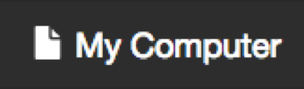
\ 

- Find the file you want to use and then upload your file. If this is the first time you are adding a file to your VoiceThread, you will be asked to "Add VoiceThread Settings" (see below).

## Selecting Media from an Online Source

-   You also have the option of searching for and using images from existing online sources. Click on the \[Media Sources\] button.

\ 

-   The screen will refresh with a number of different sources available to you. These instructions will walk you through obtaining a photo through the online photo sharing service Flickr, but the process is the same for all sources. So, click on the option.

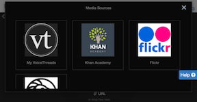
\ 

-   You have the choice of exploring different categories (such as "Animals," "Computers," and "Science") or searching for a word or phrase. If you choose to explore a category, just click on the category.

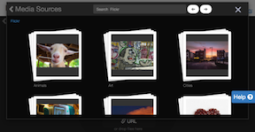
\ 

-   If you choose to search, type the word or phrase into the search box and hit the \[ENTER\] key on your keyboard.

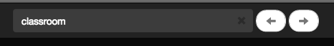
\ 

-   The page will refresh again and provide the results of your search or the available photos in your selected category. Scroll through and then click once on a photograph you would like to use; it should now appear with a blue border around it.

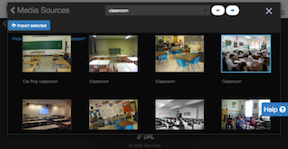
\ 

-   In addition to the blue border around your selected photo, notice that a button appears with options to Preview or Import the image. Go ahead and click on the Import option to import the photo into your VoiceThread.

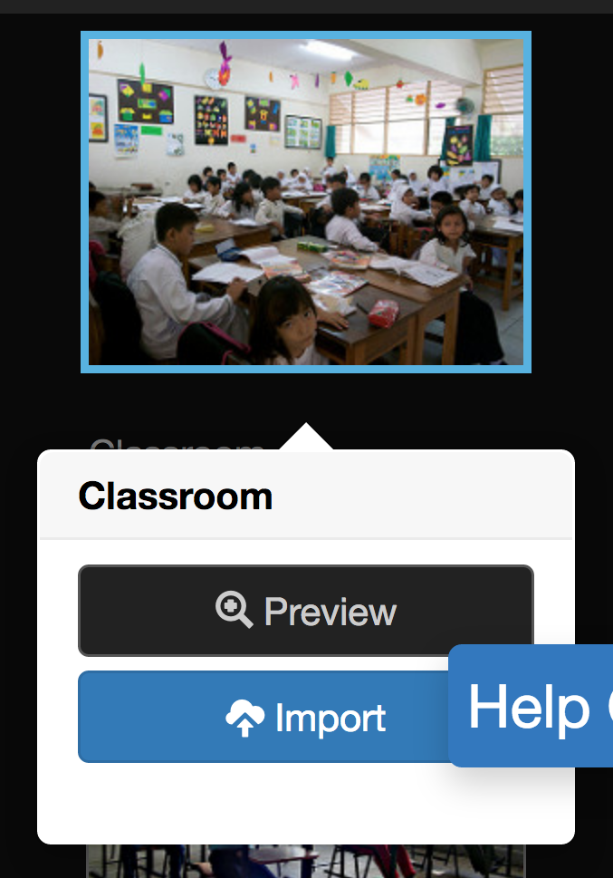
\ 

-   Note that a "Media Imported" message appears. If this is the first time you are adding a file to your VoiceThread, you will be asked to "Add VoiceThread Settings" (see below).

## Adding Thread Settings

-   If this is the first VoiceThread will the prompt you to enter some "Thread Settings." This information describes your VoiceThread project as a whole, not just the one image or slide you uploaded or selected. Go ahead and give your VoiceThread an appropriate Title and Description and then click on the \[Save\] button.

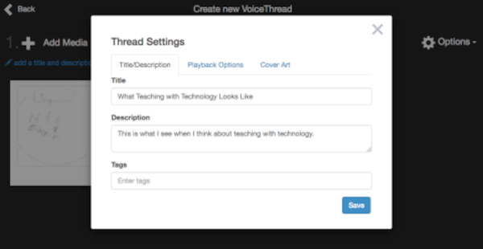
\ 

## Adding Comments

Adding comments is where VoiceThread's power really comes through. This is how you add a comment on someone else's VoiceThread as well.

-   Once you have your photos set, you are now ready to add
comments to your VoiceThread. On the main VoiceThread screen, click on the option. The screen will refresh with an expanded view of your VoiceThread.

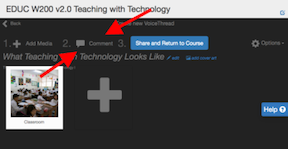
\ 

-   When you are viewing the VoiceThread, you may view existing comments by clicking on the avatar or image of the person who has already left a comment. You may also press the button, which will move through all existing comments in order.

-   To leave a comment, click on the button just above the bottom of the screen.

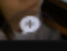
\ 

-   You will be offered a number of different options, such as adding a text comment, comment by phone, recorded audio comment, video comment, or uploading a file. Adding a comment by phone may cost you money, so this is not recommended. Most comments you are expected to contribute have nothing to do with separate files, so instructions for uploading a file are not included here.

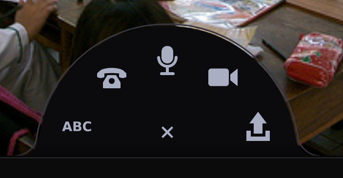
\ 

### Text Comments

-   To add a text comment, click on the text comment option (it is represented by ABC). You will then be presented with a text pop-up box. Type in the box and then click on the button when you are ready. Your comment then gets added to the end of the timeline.

\ 

### Audio Comments

-   To add a recorded audio comment, click on the audio comment option (it is represented by a microphone). The first time you click on this option, you may be asked to approve VoiceThread's use of your computer's microphone. Click the \[Allow\] button.

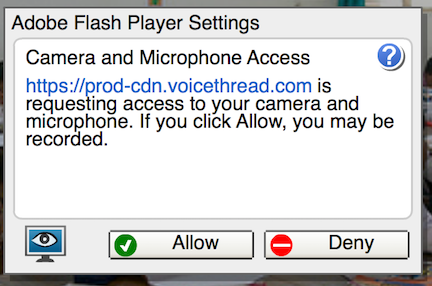
\ 

-   You will see a countdown screen, which is your cue as to when recording will start. Once it counts down, you can talk and your computer's microphone will record you. When you are ready, click on the Stop button at the bottom of the screen. VoiceThread will play the recording back to you, and if you are satisfied, click on the Save button and your voice comment will be added to the end of the timeline. If you are not satisfied, click the button and you can re-record your comment.

### Video Comments

-   To add a recorded video comment, click on the video comment option (it is represented by a video camera ). The first time you click on this option, you may be asked to approve VoiceThread's use of your computer's camera, much like recording an audio comment. Click the button.

-   Just like with audio recording, you will see a countdown screen, which is your cue as to when recording will start. Once it counts down, you can talk and your computer's camera will record you. When you are ready, click on the Stop button at the bottom of the screen. VoiceThread will play the video back to you, and if you are satisfied, click on the Save button and your voice comment will be added to the end of the timeline. If you are not satisfied, click the button and you can re-record your comment.

### Finish Commenting

-   When you are done, click on the close button in the shape of an X to return to your VoiceThread. You are now ready to share. Go ahead and click on the button.

## Sharing and Submitting Your VoiceThread

You can share your VoiceThreads in two ways. In order to submit your VoiceThread to Canvas, you need to follow the instructions for both ways.

### Sharing from the Thread Editing Screen
-   While working on your thread, click on the \[Share and Return to Course\] button at the top of the screen.

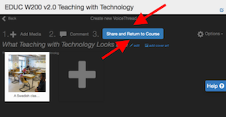
\ 

-   First, make sure that the "View and comment" option is selected under "Others will be able to:" so that your instructor (and other students) will be able to access and comment on your VoiceThread. Then click on the \[Submit/share with \{Course Name/Number\}\] button. You will then be returned to the VoiceThread Dashboard for the course.

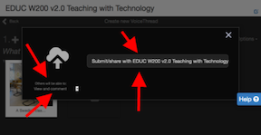
\ 

### Sharing from the Dashboard

-   From the Dashboard, hover your mouse pointer over the thumbnail for your Thread and then click on the "Share" option, which has an icon like a bent arrow.

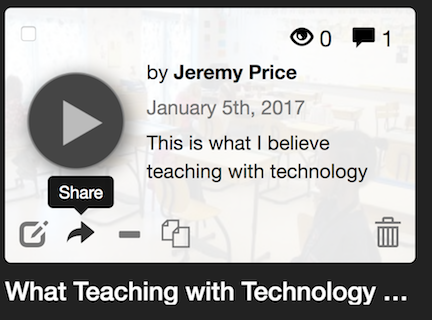
\ 

-   Click on the "Basic" tab, and make sure that the boxes next to `View` and `Comment` are checked, and then click on the \[Copy Link\] button.

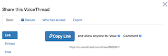
\ 

-   The link is then copied for you and you can paste it into the URL box on Canvas. To return back to your VoiceThread main screen, click on the close (X) button.

**And that's it!**
