This reference sheet will lead you through the process of getting started with VoiceThread. VoiceThread allows conversations to be conducted around a set of images, videos or slides.

# Navigating to Edublogs

-   Open a web browser and navigate to <http://edublogs.org/>. This will bring up the Edublogs front page.

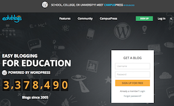
\ 

# Sign up for Edublogs

-   Find the \[SIGN UP\] button in the upper right corner of the page and click on it.

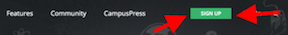
\ 

-   When presented with the option, click on the \[I'M AN EDUCATOR\] button to describe yourself (because you are on your way!).

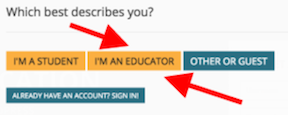
\ 

-   You will then be asked to fill out a form with a Username and Password. I recommend using your IUPUI email address so that you get used to using a "professional" email account for specific reasons. Respond to the "Human Verification" prompt and then check the box to agree with the terms of service. Then click the \[CONTINUE TO CREATE A BLOG\] button.

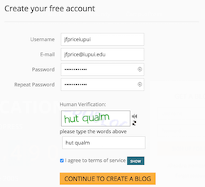
\ 

-   Enter in a blog domain (the part that you will type in for the web adress, such as jfpriceiupui.edublogs.org) and the name for your blog. You can always change your blog title later. When you are ready, click on the \[REGISTER AND CREATE A BLOG\] button.

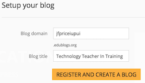
\ 

- Your blog is now all set up and you are ready to go. Click on the \[GO TO DASHBOARD\] button to continue.

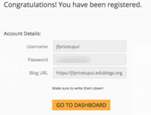
\ 

# Working with your Dashboard

- The Dasboard is where you will start each time you log in to Edublogs. In addition, the Dashboard will give you an overview of your-and your visitors'-activities.

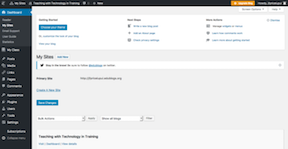
\ 

# To Do Your First Time in Edublogs

When you first sign up for Edublogs, it automatically create a post entitled "Hello world!" This is not the Hello World post you want, so you are going to want to delete it.

-   In order to delete this post, find the link in the right sidebar entitled "Posts" and click on it.

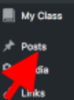
\ 

-   The Dashboard will be replaced with a list of all your posts, in draft and published. At this point, you should only have the published "Hello world!" post. Move your mouse pointer over the name of the post and then click on the "Trash" link that appears to delete it.

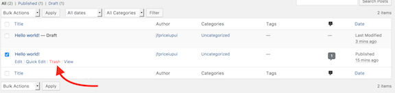
\ 

- Once that is done, return to the Dashboard by clicking on the "Dashboard" link in the upper left corner of the page.

# Creating Your First Post

-   Find the "Write a new blog post" link under the "Next Steps" header near the top of the page and click on it.

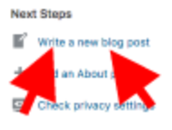
\ 

-   You will be taken to an editing screen, where you can go ahead and type in the box. You are welcome to use the formatting options, such as bold, italics, etc., to add some "flair" to your post. It works very similar to a word processor.

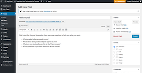
\ 

## Adding an image

- In order to add an image, first find one. I recommend finding one at http://photosforclass.com because you are allowed to use these photos and they have the citation information built right into them.

- To add an image, click on the \[Add Media\] button just above the text box area.

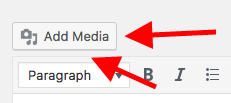
\ 

- Click on the \[Select Files\] button and then locate the image you want to use in your post. You may also just drag the image file onto the screen and it will be uploaded to your blog.

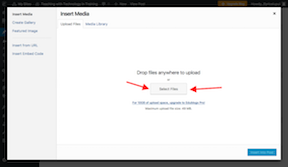
\ 

- Once the image is finished uploading to Edublogs, the screen will refresh with information about the image. It will use the filename for the image title, so please go ahead an change this. Once you are ready to place it in your blog post, click on the \[Insert Into Post\] button.

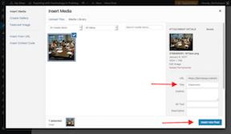
\ 

- You will be returned to editing your post, and you will see your image in the post where your cursor was. After you click the image, you can move it, resize it, and change the position of it by using the pop-up tools.

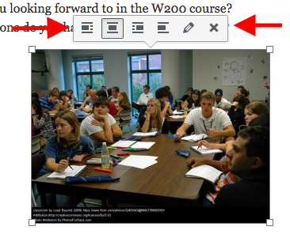
\ 

## Saving and Previewing Your Post

-   Note that Edublogs saves your post as you write. However, it is always a good idea to occasionally click on the \[Save Draft\] button on the right hand side of the page just to make sure.

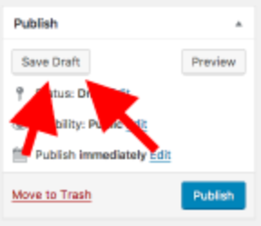
\ 

-   In addition, you can see what your post is going to look like "live." Go ahead and click on the \[Preview\] button, located next to the \[Save Draft\] button.

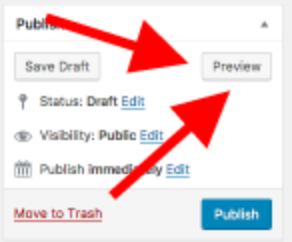
\ 

-   Edublogs will open your post in a new tab or window so you can see what it looks like. To return to editing your post, simply close the tab or window.

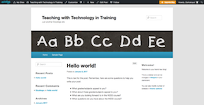
\ 

# The Last Step: Publishing and Copying the Link

-   Once you are done writing your post and are ready to share and submit it, click on the \[Publish\] button on the right-hand side of the page under the \[Save Draft\] and \[Preview\] buttons.

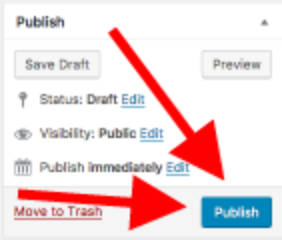
\ 

-  Once your post has been posted, the page will refresh with a notification near the top of the screen. You can click on the "View post" link to see what it looks like.

- You will also see a link next to the word "Permalink." Permalink means this link will never change (unless you manually change it) and will go directly to your post. Copy this link and paste it into the URL box in Canvas.

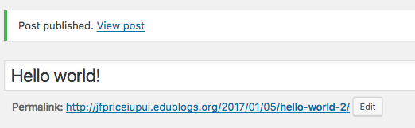
\ 

**And that's it!**
